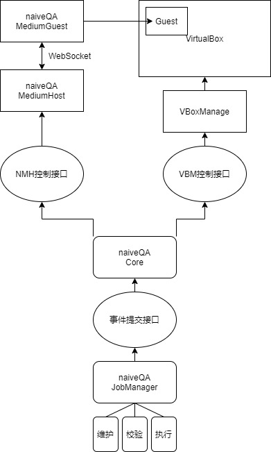

# naïveQA
一个基于VirtualBox的简易QA系统，特点是功能纯粹且易于部署，并对Windows友好

**此项目处于规划阶段**

## 特性
* 实现大部分（我们认为）必需的openQA功能
* 流式控制与函数化功能调用
* 基于图像识别（OpenCV.js）的自动识别与点击
* 跨平台的VirtualBox主宿双向通讯与文件传输
* 多抽象层和模块化的程序架构，可以快速切换至新版本VBoxManage或是新的虚拟机通讯媒介，甚至全新的控制文件管理器

## 架构

### naiveQA Core
naiveQA核心，负责根据提交的事件协调控制NMH（naiveQA Medium Host）和VBM（VBoxManage），也是在此处利用OpenCV执行点击和结果判断；Core主要由逻辑构成，因此体积可以非常小
### naiveQA Job Manager
naiveQA工作管理器，主要功能是维护、校验和执行对应的工作；此模块会将控制文件描述的操作步骤具象化为事件传递给naiveQA Core，并负责生成报告
### naiveQA Medium
naiveQA的宿主机通讯程序，在实际运行时会分为Host和Guest两个角色，主要功能有：双向传递消息、双向传递文件、打开宿主机程序等